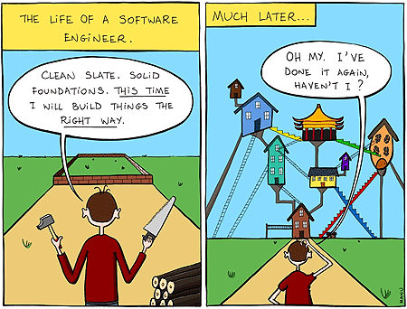
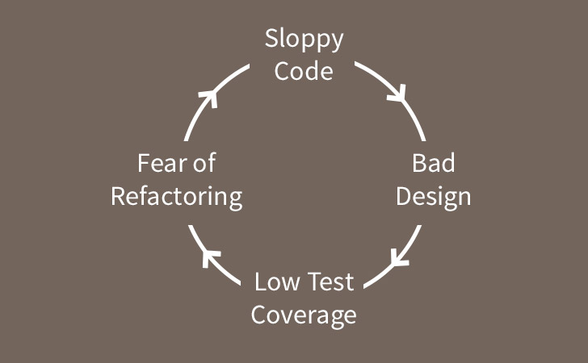

# Errors!

### What is an error?

> Errors can be coding errors made by the programmer, errors due to wrong input, and other unforeseeable things.

```js
var err = new Error("a serious problem you cannot recover from.");
// Ex: ReferenceError, TypeError
```

The program crashes and spits out the error and callstack to stdout

```js
a serious problem you cannot recover from.
   at Constraint.execute (deltablue.js:525:2)
   at Constraint.recalculate (deltablue.js:424:21)
   at Planner.addPropagate (deltablue.js:701:6)
   at Constraint.satisfy (deltablue.js:184:15)
   at Planner.incrementalAdd (deltablue.js:591:21)
   at Constraint.addConstraint (deltablue.js:162:10)
   at Constraint.BinaryConstraint (deltablue.js:346:7)
   at Constraint.EqualityConstraint (deltablue.js:515:38)
   at chainTest (deltablue.js:807:6)
   at deltaBlue (deltablue.js:879:2)
```

### How to read call stack

```js
Error: 'The Problem'
  at 'the function which ran the code where the error occured' (filename.js:lineNumber:characterNumber)
```

### What is an exception?

> Something you can recover from - an error that you might want to **try** to **catch**

```js
function NotAMonth(message) {
   this.message = message;
   this.name = "NotAMonth";
}

function intToMonth(n) {
   var months = ["Jan", "Feb", "Mar", "Apr", "May", "Jun", "Jul",
      "Aug", "Sep", "Oct", "Nov", "Dec"];
  
  if (n >= 1 && n <= 12) {
    return months[n-1]; // offset by 1 to account for 0 indexing
  } else {
    throw new NotAMonth("Not a month, you serious bozo");
  }
}

// try something that might fail
var monthName;

try {
   var myMonth = 15;
   monthName = intToMonth(myMonth);
} catch (e) {
  // recover inside catch!   
   monthName = "unknown";
   console.err(e.message, e.name); // pass exception object to err handler
}
// contine with program if no exception or exception was caught
console.log(monthName);
```
---

# Testing




Technical Debt - The larger a software project gets, the harder it is to 'maintain'

## Vicious Cycle!


## Assert

Built into node: [Assert API](https://nodejs.org/api/assert.html)

``